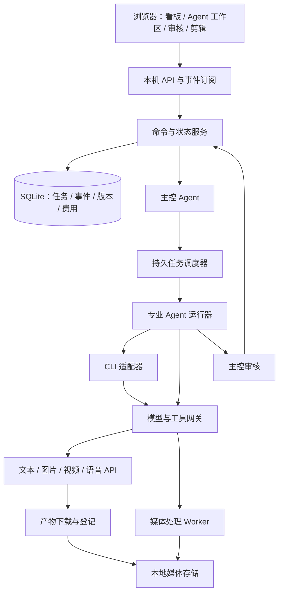

# Spark Story 技术设计

版本：0.1；日期：2026-09-05；状态：建议实施方案，未实现、未进行付费连通测试。

产品规则见 [01-产品设计.md](01-产品设计.md)。本文选择面向本机单用户的模块化架构；具体依赖版本在实现时锁定，不依赖模型名称或供应商价格永久不变。

## 1. 架构与职责

建议使用 TypeScript + Bun，前端 React，后端本机 HTTP 服务，SQLite 保存关系与状态，本地文件保存媒体。后台进程独立于网页生命周期。队列首先持久化在 SQLite，首版无需引入 Redis、集群或独立分布式工作流服务。

Bun 提供 SQLite 能力，具体接口以实现时锁定版本为准。[Bun SQLite 文档](https://bun.sh/docs/runtime/sqlite)



主控拥有业务决策权；调度器落实决策并检查状态、租约、预算和权限。调度器不能替代用户批准创作变更，模型也不能直接改数据库跳过规则。

主控不必常驻消耗模型调用。新任务、完成、中断、审核失败、用户指令等事件触发一次主控处理。长期等待视频生成时由 Worker 轮询，避免主控反复询问进度。

专业 Agent 是平台定义的职责单元，不要求供应商原生 sub-agent 功能。CLI 自带子代理可作为执行细节，但不能因此获得平台跨任务调度权限。

### 1.1 建议模块目录

```text
apps/web/                    浏览器界面
apps/server/                 HTTP、事件订阅、后台入口
packages/domain/             类型、状态机、校验规则
packages/orchestrator/       主控协调、任务图、审核与变更
packages/agents/             Agent 定义、上下文装配、交付契约
packages/connectors/         API 与 CLI 适配器
packages/media/              媒体检查、合成、字幕与音轨
packages/storage/            SQLite、资产文件、迁移与备份
packages/contracts/          请求/响应与结构化输出 Schema
```

安装与运行统一使用 bun。首版建议后端原生 HTTP 路由或轻量路由层，先验证 Bun 子进程、流式读取和文件服务，不为简单本机场景绑定大型 Agent 框架。

## 2. 核心数据模型

| 实体 | 核心字段 / 关系 |
| --- | --- |
| Project | id、name、language、aspectRatio、renderProfileId、styleVersionId、configRevision |
| SourceDocument | projectId、originalArtifactId、format、parseState、coverage |
| SourceChunk | documentId、chapter/page/paragraph、text、hash |
| StoryRevision | projectId、outline、worldRules、timeline、facts、sourceRefs |
| Episode | projectId、orderKey、title、scriptRevisionId；不强制 totalEpisodes |
| Scene | episodeId、locationId、timeOfDay、participants、dramaticPurpose |
| DialogueRevision | stableDialogueId、revision、speakerId、text、delivery、sourceRefs |
| ShotRevision | stableShotId、revision、sceneId、orderKey、composition、motion、dialogueRefs、route |
| Asset | id、projectId、kind、entityId、formalVersionId |
| ArtifactVersion | assetId、revision、blobHash、mime、metadata、origin、producerAttemptId |
| Dependency | consumerType/id/revision、producerVersionId、semanticScope、strength |
| AgentDefinitionVersion | role、prompt、allowedTools、inputSchema、outputSchema、modelBindings |
| AgentRun | definitionVersionId、taskId、contextSnapshotId、connectionId、sessionId、status |
| Task | projectId、episodeId、kind、scope、revision、status、inputSnapshotId、qualityRound |
| TaskAttempt | taskId、revision、attemptNo、retryKind、leaseToken、startedAt、heartbeat、finishedAt |
| ExternalJob | attemptId、connectionId、providerJobId、submitKey、state、requestFingerprint |
| Review | targetVersionIds、reviewer、verdict、findings、evidence、rubricVersion |
| Approval | stageId、manifestHash、revision、userDecision、createdAt |
| Intervention | taskId、targetRevision、message、intentState、affectedScope、resumeState |
| Connection / ModelBinding | transport、provider、credentialRef / capability、model、parameters、fallbacks |
| Budget / CostReservation / CostEntry | project、currency、limit / invocation、estimated / actual、status |
| TimelineRevision | episodeId、revision、tracks、clips、transitions、subtitleStyle、renderProfile |
| Event / Outbox | sequence、type、aggregateId、revision、payload / deliveryState |

人物、场景、服装、道具、声音绑定均有稳定实体 ID；具体图片或音频由 ArtifactVersion 表示。人物身份不等同某张图片。

数据库开启外键，关键写入使用事务。建议 WAL 模式、短事务和单独调度写入口；队列领取用条件更新，不能依赖“先 SELECT 后 UPDATE”的非原子竞争。

### 2.1 不可变输入快照

每次尝试保存：故事/剧本/镜头版本、正式资产版本、模板版本、Agent 定义版本、实际模型与参数、工具版本、用户指令、审核标准。任务执行过程中不偷偷读取后来变化的 latest。

正式版本切换通过条件更新完成。用户审阅版本 A 时后台生成版本 B，用户点击通过仍只批准 A。版本冲突返回明确错误并刷新审核内容，不能批准未看过的内容。

### 2.2 长篇上下文

结构化事实索引记录来源和时间范围；全文按章节与场景分块。先使用全文检索与结构化筛选，向量检索属于可替换增强。子 Agent 只接收本任务需要的故事事实、人物状态、前后镜头、台词、参考资产和用户约束。

对未知、冲突和未确认设定显式标注。主控最终回复不能把分层摘要中的猜测升级成原作事实。

## 3. Agent 任务协议

建议用 JSON Schema 校验输入和交付，以下为平台协议示例，不是任何供应商的原生请求格式。

```json
{
  "taskId": "task-shot-012",
  "revision": 4,
  "role": "video",
  "goal": "生成雨夜走廊中主角转身的镜头",
  "inputSnapshotId": "snapshot-012-r4",
  "inputs": [{"artifactVersionId": "keyframe-012-v3", "purpose": "start_frame"}],
  "constraints": {"aspectRatio": "9:16", "dialogueIds": [], "route": "separate"},
  "allowedTools": ["assets.read", "video.submit", "jobs.poll", "artifacts.publish", "self.interrupt"],
  "deliverables": [{"kind": "video", "required": true}],
  "reviewRubricId": "video-rubric-v1"
}
```

交付包含 taskId、revision、attemptId、产物 ID、工具执行记录、已满足约束、已知问题、建议。退出码为 0 不代表业务成功；必须交付 Schema 合法、文件存在、可解析、与输入修订匹配的产物。

主控工具：createTasks、assignTasks、pauseTasks、resumeTasks、requestRework、submitStageReview、resolveIntervention。所有命令带 expectedRevision 和幂等键。

子 Agent 工具：readInputs、invokeCapability、reportProgress、publishCandidate、reportIssue、interruptSelf。没有跨任务停止、正式版本发布和直接批准用户关卡的权限。

## 4. 状态机与队列

### 4.1 任务状态

```text
draft → blocked / ready → running → external_wait → review_pending
review_pending → accepted
review_pending → rework_pending → ready
review_pending → needs_user（质量返工用尽）
running / external_wait → interrupting → paused
任意可运行状态 → budget_blocked / provider_blocked / needs_user
paused → ready（新修订或核实后续跑）
终止：cancelled / failed；过时：superseded
```

external_wait 可直接返回 review_pending，也可因后处理回到 running。没有外部生成的文本任务直接进入 review_pending。

任务 accepted 表示主控通过；阶段 user_approved 才允许跨越用户关卡。accepted 不能代替 user_approved。

### 4.2 领取与并发

调度器只领取依赖满足、关卡允许、连接可用且预算允许的任务。领取生成 leaseToken 和到期时间，Worker 心跳续租。旧 lease 不能更新新尝试。

建议默认全局生成并发 3，同一 CLI 连接并发 1，视频连接并发 1，媒体渲染并发 1；这是可调资源默认值，不是用户内容限制。并发最终取全局、供应商、连接和资源上限中的最小值。

主控以项目为单位串行落实变更决策；专业任务可并行。外部轮询不占用模型执行槽，但算作活跃外部任务以限制供应商队列规模。

### 4.3 持久事件

状态变更和 Outbox 事件同事务提交。后台至少一次投递，消费者按 eventId 去重。浏览器使用 SSE 订阅并携带最后事件序号，断线重连可以补齐；大媒体走独立 HTTP 文件读取和 Range 请求。

建议事件：task.created、task.started、tool.started、artifact.created、review.failed、review.passed、stage.awaiting_user、intervention.requested、task.interrupted、plan.revised、budget.blocked、provider.unavailable、render.completed。

事件只携带必要元数据与产物 ID，不把密钥、大图片或完整媒体放入事件流。

## 5. 中断、影响分析与恢复

### 5.1 中断协议

1. 用户指令进入后台；事务创建 Intervention，给目标任务设置中断标记，并提高该任务执行修订/失效标识。
2. 子 Agent 运行器立即停止新工具调用，代其持久汇报当前 attempt、输入修订、已完成文件和外部 job；汇报不依赖正在运行的模型响应。
3. CLI 先请求取消或发送 SIGINT；建议宽限 5 秒后终止属于该 attempt 的进程组。不能按进程名杀掉用户其他 CLI 会话。
4. 外部 API 若支持取消则请求；不支持则标记 cancel_requested_but_running，继续最小状态跟踪以便结算和收回产物。
5. 主控读取持久汇报，按依赖与语义判断暂停、作废、重做的任务集合；调度器落实。
6. 明确要求产生新修订并继续；模糊意见产生修改提案，等待确认。

用户干预后，受影响产物的“可晋升资格”立即冻结，防止主控尚未处理时旧结果推进流程。这是版本有效性规则，不代表子 Agent 越权停止其他 Agent。已运行的其他任务是否取消仍由主控决定。

主控恢复前，系统持有该分支的晋升屏障；无依赖分支可继续。无法取消的结果保留为旧修订候选，并记账。

### 5.2 影响范围

| 修改 | 通常受影响 | 通常可复用 |
| --- | --- | --- |
| 角色发色 | 引用该外观的关键帧、视频、合成 | 剧本、未变化配音 |
| 台词文字 | 配音、字幕、口型、可能的镜头时长 | 与台词无关的场景资产 |
| 配音情绪 | 对白音轨、口型、混音、可能的节奏 | 台词文本、角色定妆 |
| 背景音乐 | 音乐轨、混音和导出 | 图像、视频、配音 |
| 镜头顺序 | 时间线、转场、音效/字幕时间定位 | 合法的既有镜头媒体 |
| 画幅 | 构图、预览、关键帧、视频与导出，按镜头检查 | 故事、对白、音乐原始文件 |

依赖图找出确定性受影响集合；主控补充叙事、光照、人物状态等语义影响。默认标记 stale，不删除原文件。允许选择当前集或全项目影响范围，用户明确指定时直接遵循。

### 5.3 崩溃恢复与外部提交不确定性

启动时恢复未完成尝试，核验 lease、进程归属、外部 job 和文件完整性。不能只靠旧 PID 判定进程仍是原任务，需关联启动时间与运行标识。

外部提交前先写 submission_intent、请求指纹和供应商支持的幂等键；响应后登记 jobId。如果提交成功但响应丢失，优先按幂等键/供应商查询恢复。既无 jobId 又无可查询幂等机制时标记 submission_unknown，不自动重新付费提交。

本地合成使用临时输出文件，完成并检查后原子移动到产物库。CLI 进程死亡后恢复依赖平台任务快照；供应商 session resume 是增强能力，不能替代持久状态。

## 6. API 与 CLI 接入

### 6.1 六类模型与能力标签

六类配置面向用户；内部以能力标签调度：text.generate、tool.call、image.generate、image.edit、vision.inspect、video.generate、video.image_to_video、video.native_audio、audio.tts、audio.transcribe、audio.music、audio.sfx、lip_sync。

每个绑定包含 connectionId、modelId、parameters、fallbacks、capabilities。继承顺序为全局 → 项目 → Agent 定义/任务覆盖。运行时冻结最终结果，配置修改只影响后续尝试。

供应商“支持某模态”不等于任意模型支持全部参数。记录图像数量、参考方式、尺寸、时长、语言、声音控制、取消、查询与幂等支持；未知字段保持 unknown，不能视为支持。

### 6.2 通用适配器契约

```ts
interface CapabilityAdapter {
  probe(): Promise<CapabilityReport>;
  estimate(request: NormalizedRequest): Promise<CostEstimate>;
  submit(request: NormalizedRequest, context: AttemptContext): Promise<Submission>;
  poll?(job: ExternalJobRef): Promise<JobStatus>;
  cancel?(job: ExternalJobRef): Promise<CancelResult>;
  collect(result: ProviderResult): Promise<ArtifactManifest>;
  classifyError(error: unknown): NormalizedError;
}

interface CliAdapter {
  probeExecutable(path: string): Promise<CliCapabilities>;
  start(context: AgentRunContext): AsyncIterable<AgentEvent>;
  interrupt(run: RunHandle): Promise<InterruptResult>;
  resume?(run: RunHandle, context: AgentRunContext): AsyncIterable<AgentEvent>;
}
```

规范化错误：auth_required、quota_exhausted、rate_limited、timeout、invalid_request、unsupported_capability、provider_error、submission_unknown、cancelled。保留去敏原始错误，以免错误分类掩盖真实问题。

### 6.3 CLI 核实结果

2026-09-05 只执行了本机 --help / --version 和路径检查，没有运行生成任务，也没有读取登录凭据。

| 工具 | 本机观测 | 适配方案与限制 |
| --- | --- | --- |
| Codex CLI | /usr/local/bin/codex；0.42.0；exec 帮助含 --json、--output-schema、resume | 使用 exec JSONL；版本明显应独立记录，不能照最新文档假定所有能力 |
| Claude Code | /Users/john/.local/bin/claude；2.1.250；支持 -p、stream-json、session/resume、工具配置 | 使用结构化流；按实际帮助装配参数和允许工具 |
| Grok Build | /Users/john/.local/bin/grok；1.0.13；有 headless 输出、JSON Schema、会话恢复、agent 子命令 | 独立适配 Grok 的事件格式，不能套用 Claude 的 stream-json 名称 |
| grokcli | PATH 中未找到名为 grokcli 的命令；检索到 grokcli.dev 项目 | 暂将该项目作为候选；具体发行包、二进制、非交互与取消协议需要联调核实 |

Codex 官方说明提供 exec 非交互方式；Claude Code 官方说明提供 print 和流式输出；Grok Build 有独立官方产品；grokcli.dev 为另一个项目入口。以上只证明适配依据，不证明本平台已兼容。[Codex](https://developers.openai.com/codex/noninteractive)、[Claude Code](https://code.claude.com/docs/en/headless)、[Grok Build](https://x.ai/news/grok-build-cli)、[Grok CLI 项目](https://www.grokcli.dev/)

适配器使用绝对路径与参数数组启动子进程，提示词通过 stdin 或任务文件传递，禁用 shell 字符串拼接。不同工具可能共用 grok 命令名，连接记录 providerId、路径和版本，不能只靠名称识别。

解析 stdout 的结构化事件，stderr 单独保留；处理半行 JSON、未知事件、超长行、非零退出、断流和权限等待。未知工具先做能力探测，不能宣称自动化成功。只有 TUI 的发行版可用 PTY 作为候选降级，但需单独验收，不承诺可靠结构化进度。

CLI 登录由用户原有安装管理，平台只识别可用状态。避免使用会改变认证路径的模式参数。不能在没有明确要求时升级用户 CLI 或修改其全局配置。

### 6.4 API 供应商接入范围

“主流模型支持”落实为可扩展供应商连接与能力测试，不用一段兼容 OpenAI 的请求假装兼容全部图像、视频和音频接口。

| 接入组 | 计划覆盖 | 依据与实施边界 |
| --- | --- | --- |
| OpenAI / Anthropic | 主控、文本；适用模型的多模态检查 | 分别实现供应商原生协议与结构化交付；[Anthropic API](https://platform.claude.com/docs/en/api/overview) |
| Gemini | 文本、多模态，图像与 Veo 视频适配 | 视频为独立能力；[Google 视频文档](https://ai.google.dev/gemini-api/docs/video) |
| xAI | Grok 文本与可用图像/视频能力 | 通过账号权限和模型列表核实；[图像](https://docs.x.ai/developers/tools/image-generation)、[视频](https://docs.x.ai/developers/model-capabilities/video/generation) |
| DeepSeek / Qwen | 文本与主控候选；工具能力逐模型验证 | [DeepSeek API](https://api-docs.deepseek.com/api/deepseek-api)、[阿里云 Model Studio](https://www.alibabacloud.com/help/en/model-studio/) |
| ElevenLabs | 配音、转写、音乐音效候选 | 逐能力授权与价格配置；[官方 API](https://elevenlabs.io/api) |
| 可灵 / 火山引擎 Seedance / 通义万相 / MiniMax | 国内图片、视频、语音扩展目标 | 作为待联调供应商，不假定当前账号权限、接口或参数；实现前核实各自官方 API |
| 自定义兼容连接 | 用户指定 base URL 和 model ID | 通过 text/tool/stream 等能力测试后开放对应角色 |

具体型号不在代码枚举里锁死。设置页支持获取模型列表、手动填写模型 ID、能力覆盖和探测日期。缺少正式 API 的服务不通过网页自动化伪装为 API。

### 6.5 工具网关与执行隔离

CLI Agent 通过本机工具桥接调用平台图片、视频、语音和媒体能力，可采用 MCP 或受控本地接口；外部 API Key 不直接放进 Agent 工作目录和任务提示词。

每次尝试使用独立工作目录，输入只读快照，输出写候选目录。正式媒体库由平台发布。工作目录本身不是安全隔离；要落实“不能停其他 Agent、不能改已确认资产”，需限制进程/网络工具并利用 CLI 可用沙箱或 OS 级隔离。无法提供隔离时标注能力限制，不能声称仅靠提示词已强制保证。

后端默认绑定 loopback，校验来源与本地会话令牌。密钥存系统密钥存储，日志脱敏。项目之外的写入、删除已确认资产和系统安装按已确认边界处理；普通项目内生成和脚本自动执行。

## 7. API 预算与 CLI 可用性

### 7.1 分离 transport 与费用约束

transport=api：平台金额预算生效。transport=cli：不应用平台金额上限，不传平台自定的 max-budget 参数。即使某 CLI 内部使用 API Key，仍按用户选择的 CLI 接入政策执行，并显示其费用不由平台完整核算；CLI 内部或供应商限制仍可能生效。

CLI 通过平台调用付费 API 是一个新的 transport=api invocation，独立纳入预算。不能因为上游是 CLI 就绕过媒体费用检查。

### 7.2 原子预留与结算

使用最小货币单位整数或定点数，不用浮点累加。项目单一结算币种；多币种报价记录汇率版本和预估性质。

提交前在同一事务检查：已结算 + 活跃预留 + 本次保守预估 ≤ 上限。成功则创建 reservation；不满足则 budget_blocked。请求完成按实际费用结算；实际账单延迟则保持 provisional。

未知提交状态、无法取消但仍运行的任务不能立即释放预留。实际费用超过预估时记录差额并停止后续付费提交，预算为平台提交控制，不承诺供应商最终账单绝不超出估计。

建议首次遇到完全未知价格的连接时要求设置计价或明确未知费用额度；不把 unknown 当 0。质量返工、审核、临时配音、预览图同样计费。

### 7.3 CLI 耗尽与故障

rate_limited 按 retry-after 或有上限的退避等待；quota_exhausted 有明确恢复时间时等待恢复，否则暂停连接并通知；auth_required 等待用户恢复登录。网络超时有限次重试，持续失败转 provider_blocked，不无限循环。

以上不会用金额限制 CLI，也不会把不可用误判为作品不合格。自动切换只使用配置好的备用连接；每次切换重验所需能力，API 备用路线重新过预算。

## 8. 媒体流水线

### 8.1 文件接收与标准化

保存原始媒体，下载后校验 MIME、大小、hash、可解码性和元数据；供应商 URL 可能失效，及时复制到本地。若只收到 URL 而下载失败，尝试重新取文件，不直接再次付费生成。

视频生成输出与项目时间线解耦。项目确定时间基准和输出配置；供应商产物通过媒体 Worker 标准化帧率、尺寸、像素格式、音频采样率，保留原件。

### 8.2 时间线数据

建议使用整数时间刻度，项目保存 timebase；避免用小数秒反复累积。片段包括 sourceVersionId、timelineStart、sourceIn、duration、track、gain、crop/fit 和 transition。

轨道包括主视频、对白、旁白、音乐、音效、氛围和字幕。临时配音与正式配音带明确状态；原生音画片段有声音归属标记，避免再叠加同一句独立配音造成双声。

字幕源自确认台词与最终声音对齐，识别仅用于校验与时间定位；不能让错误 ASR 自动改掉已确认台词。中文字体打包或配置可用字体，合成前检查缺字。

### 8.3 合成与局部重做

使用 FFmpeg/ffprobe 作为计划中的媒体执行工具，实际参数在实现时核实。后期 Agent 生成结构化剪辑计划，媒体 Worker 编译并校验执行参数。Agent 不能把不受校验的命令字符串直接交给 shell。

合成键包括时间线版本、输入文件 hash、渲染配置、工具版本；同输入可复用缓存。修改音乐只更新混音与最终合成；修改画面才重做对应视频生成。导出前检查无缺片、字幕越界、非法裁切、音轨重复和时长不匹配。

### 8.4 审核输出格式

每条问题包含 category、severity、artifactVersionId、frame/timeRange、evidence、explanation、suggestedFix、confidence。确定性故障与审美建议分开。主控读取辅助视觉/音频分析结果后形成结论，不把辅助工具另设为拥有最终审批权的 Agent。

## 9. HTTP 与事件契约

| 接口建议 | 作用 |
| --- | --- |
| POST /projects | 创建项目与配置快照 |
| POST /projects/:id/sources | 导入来源并安排解析 |
| GET /projects/:id/board | 获取阶段、任务和待办 |
| POST /projects/:id/directives | 给主控提交指令 |
| GET /tasks/:id/workspace | 输入、尝试、产物和审核记录 |
| POST /tasks/:id/interventions | 中断并提交用户意见 |
| POST /interventions/:id/confirm | 确认模糊反馈的修改方案 |
| POST /stages/:id/approvals | 按 manifestHash 批准当前审核包 |
| POST /assets/:id/versions | 导入或编辑生成新候选 |
| POST /assets/:id/select-version | 指定正式版本并触发影响分析 |
| POST /episodes/:id/timelines | 保存局部编辑的新时间线 |
| POST /episodes/:id/exports | 创建导出任务 |
| POST /connections/:id/probe | 探测能力和可用性，明确是否会付费 |
| GET /events?after=sequence | 恢复浏览器事件订阅 |

写接口包含 expectedRevision 和 idempotencyKey。返回业务状态及冲突详情。单次 HTTP 请求不等待长视频生成完成，而是返回 taskId。命令越权在后端校验，前端隐藏按钮不能代替校验。

## 10. 存储、备份与可观测性

```text
用户选择的数据目录/
  state.sqlite
  blobs/<hash-prefix>/<hash>          不可变媒体
  projects/<project-id>/sources/      原始输入索引或文件
  projects/<project-id>/runs/<attempt-id>/
  projects/<project-id>/exports/<export-id>/
  cache/previews/                     可重建缩略图与代理媒体
  backups/                           用户触发的备份
```

数据库备份使用 SQLite 一致性备份方式，关联 blob 清单；不要仅复制运行中的主数据库而忽略日志状态。候选版本默认保留，不自动清理“不是正式版本”的文件。提供空间占用视图，显式删除才进行引用检查和可恢复处理。

运行记录关联 projectId、taskId、attemptId、providerJobId、revision。记录队列等待、生成时间、审核耗时、返工原因、费用估计与实际差额。不得把原始 API Key、CLI 认证文件或内部推理作为日志收集目标。

## 11. 必须保持的不变量

1. 子 Agent 只能中断自身任务；只有主控授权的调度命令能影响其他 Agent。
2. 中断前的尝试不能发布为当前正式版本。
3. 未通过用户关卡的内容不能触发关卡后的正式生产。
4. 明确用户修改不因涉及旧确认内容重复索要授权；预算边界独立成立。
5. API 并发提交必须先原子预留；CLI 执行不受平台金额预算限制。
6. 供应商提交结果未知时不盲目再次付费提交。
7. 每项产物能追溯到输入、模型、工具、用户指令与审核版本。
8. 重做失败不覆盖此前可用正式结果。
9. 任务完成、主控通过、用户批准、导出完成是不同状态。
10. 未联调的连接必须显示待验证，不能以配置项存在冒充接入完成。
